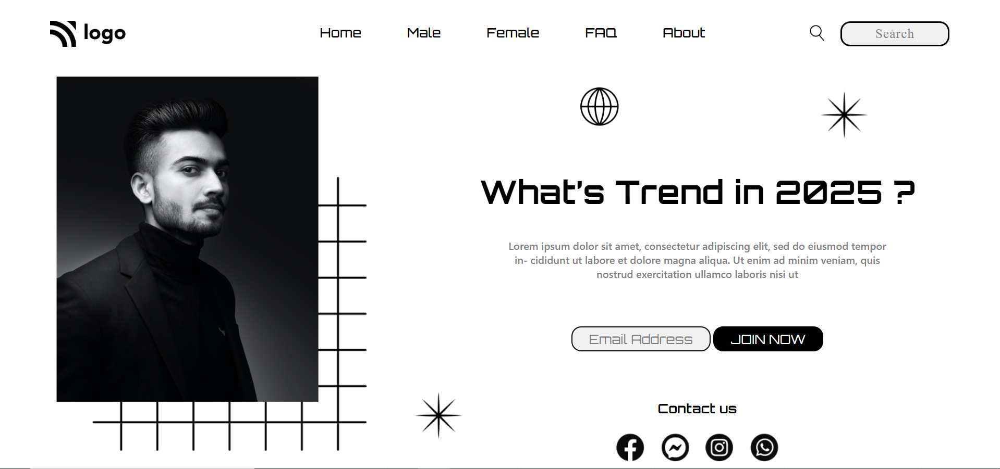

# Project 1 - HTML and CSS
By Piyush

Deployed link of Website  &thinsp;  

# [Link to Project 1](https://trend-assignment1.netlify.app/)

  

# Preview of the Project.

## What I learnt from this project?
 

- I learnt **HTML & CSS** in depth.
- I learnt about **fonts** and how to identify fonts on web.
- I learned about **CSS Positioning** properties in depth.
- I also learnt how to create **functioning buttons**.
- I also learnt about **navbar** and how to arrange it.
  
 

  
# Time Taken to done this project is around 10-12 hours. 

### This is my first project and it gives me great learning and sense of achievement.
